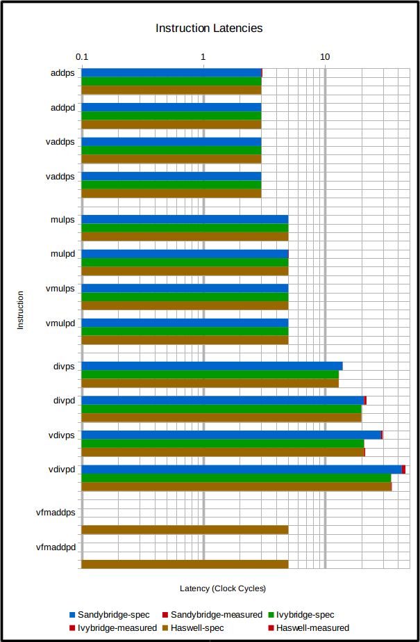
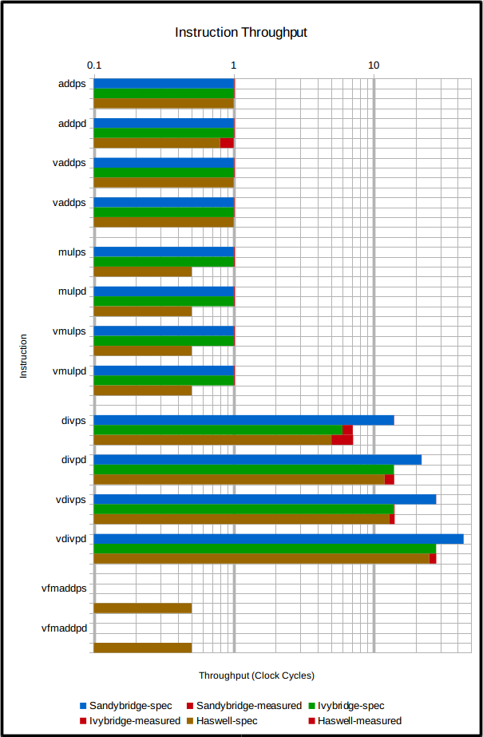

# cpu-test

Test various aspects of the CPU and memory system.

Requires PAPI for clock cycle counting.

Run with OMP_PROC_BIND=true for more reliable results.

## Instruction Latency and Throughput Measurements
The following graphs show the measured latency and throughput of various instructions, for various CPU architectures. The red parts of the bar show where the measurement exceeds the architecture's quoted value (from Intel Intrinsics Guide).

Observations:

- Ivy Bridge and Haswell do not appear to perform as well as they should. Haswell is upposed to have a latency of 0.8 for `addpd`, and neither achieve their quoted numbers for the various `div` instructions.

